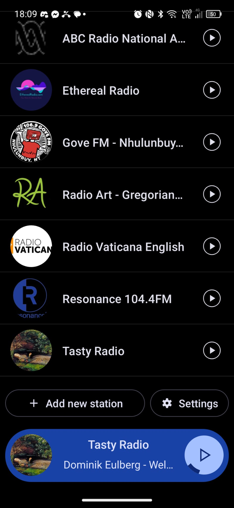
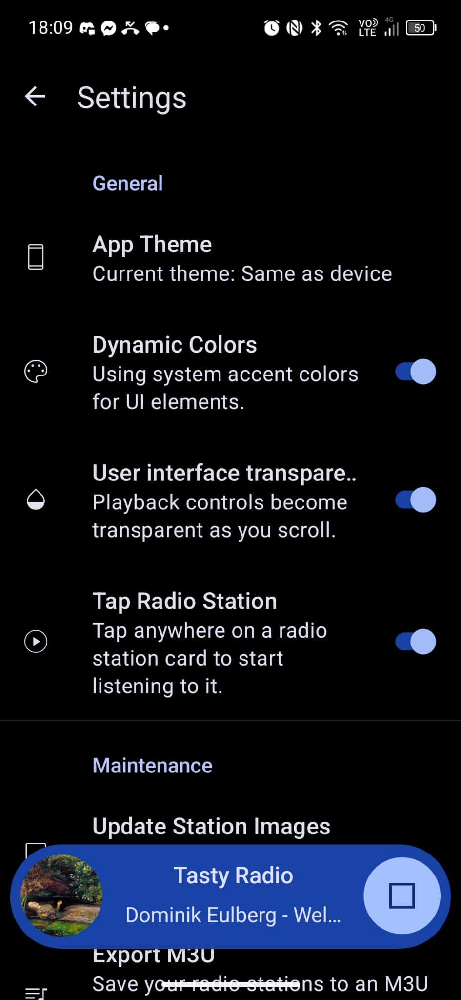
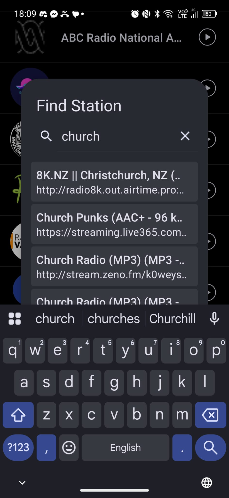
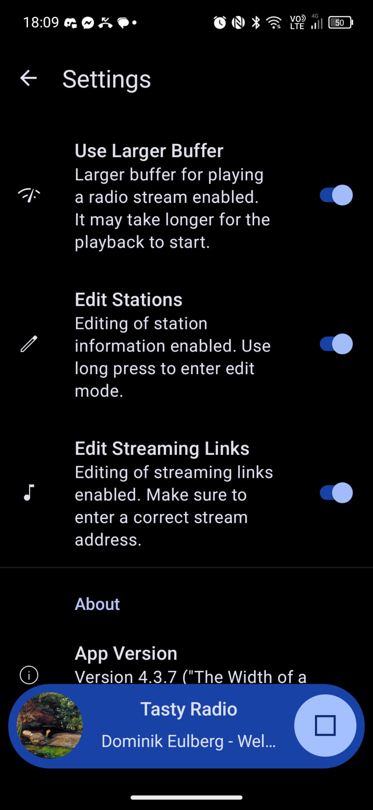

# Reference screenshots — Transistor

These are screenshots of **[Transistor](https://github.com/y20k/transistor)** (version
**4.3.7**, codename *"The Width of a Circle"*) running on the owner's Android phone. They were
supplied as the design target for Tasty Radio: *"the goal of the app is to be a bit like
another radio app 'Transistor'."*

They are a **reference for feel and feature set, not a pixel spec** — Tasty Radio is its own
app, not a clone.

| File | Screen | |
|---|---|---|
| [`01-station-list.jpg`](01-station-list.jpg) | Main station list + playback bar | ✅ |
| [`02-settings-general.jpg`](02-settings-general.jpg) | Settings → General | ✅ |
| [`03-find-station.jpg`](03-find-station.jpg) | "Find Station" search dialog | ✅ |
| [`04-settings-advanced.jpg`](04-settings-advanced.jpg) | Settings → buffer / editing / About | ✅ |
| `05-settings-maintenance.jpg` | Settings → Maintenance | ❌ **missing** |

> **⚠️ Screenshot 05 is missing.** The source file saved as 0 bytes, so only the written
> breakdown below survives for that screen. It's the least design-critical of the five (a
> plain preference list), but re-capture it if the Maintenance screen ever needs to be
> matched precisely.

---

## 01 — Station list (the home screen)

A full-bleed dark screen, no top app bar visible while scrolled. A simple vertical list of
stations, each row being:

- a **circular station image** on the left (~logo-sized), fetched from the station's own artwork
- the **station name**, single line, **truncated with an ellipsis** when too long
  ("ABC Radio National A…", "Gove FM - Nhulunbuy…", "Radio Art - Gregorian…")
- a **circular outlined play button** on the right
- a thin divider between rows

The list is the whole app. No tabs, no bottom nav, no search field on screen. Stations in the
owner's own collection give a good sense of the target audience: *ABC Radio National*,
*Ethereal Radio*, *Gove FM Nhulunbuy NT*, *Radio Art – Gregorian*, *Radio Vaticana English*,
*Resonance 104.4FM*, *Tasty Radio*.

Below the list, two pill-shaped outlined buttons side by side:
**`+ Add new station`** and **`⚙ Settings`**. These scroll with the content — they sit at the
end of the list rather than being a fixed bar.

### The playback bar
Pinned to the bottom, floating above the content as a **rounded pill** in the accent colour
(blue here — this is Material You dynamic colour, so it follows the system wallpaper):

- circular artwork of the **currently playing** station on the left
- **station name** (bold) on the first line
- **stream metadata** on the second line — the current track, e.g. "Dominik Eulberg – Wel…",
  again ellipsised. When no track metadata is available it **falls back to repeating the
  station name** (visible in `05`, where the second line just reads "Tasty Radio").
- a large circular button on the right that is **▶ play** when stopped and **■ stop** when
  playing (note: *stop*, not pause — correct for live streams, which can't be resumed)
- while buffering/connecting, a **progress arc** is drawn around that button (visible in `01`)

This bar persists across screens — it's still there on top of the Settings screen in `03`,
`04` and `05`, overlapping the content underneath.

---

## 02 — Settings → General

Standard scrolling preference list. Back arrow + "Settings" title. Section header **General**
in the accent colour. Each row: leading icon, title, supporting description, trailing switch.

- **App Theme** — "Current theme: Same as device" (no switch; opens a chooser)
- **Dynamic Colors** — "Using system accent colors for UI elements." *(on)*
- **User interface transparency** — "Playback controls become transparent as you scroll." *(on)*
- **Tap Radio Station** — "Tap anywhere on a radio station card to start listening to it." *(on)*

Then the **Maintenance** section begins (see `05`).

---

## 03 — Find Station (search)

A **dialog** (not a full screen) over a dimmed station list, rounded corners, titled
**"Find Station"**. Inside:

- a search field with a leading magnifier icon and a trailing **✕** clear button; the query
  shown is `church`
- results appear **live as you type**, in a scrolling list of rounded cards, each showing
  **station name (+ codec/bitrate in parentheses)** on top and the **raw stream URL** below,
  both ellipsised:
  - `8K.NZ || Christchurch, NZ (..` → `http://radio8k.out.airtime.pro:..`
  - `Church Punks (AAC+ - 96 k..` → `https://streaming.live365.com..`
  - `Church Radio (MP3) (MP3 -..` → `http://stream.zeno.fm/k0weys..`
  - `Church Radio (MP3) (MP3 - …` (partially cut off)

This is the **radio-browser.info** API, queried live, and — from this result set — searching
**station names only**. Two things worth carrying over: results are shown with **codec and
bitrate**, and the **stream URL is shown directly** — the user is trusted to see the plumbing.
Also note several results are plain **`http://`**, which matters for Android's cleartext policy.

The soft keyboard is open with a **search** action key.

> **This is the screen Tasty Radio changes most.** Name-only search means typing `religion`
> returns nothing even though Vatican Radio is in the database tagged `catholic, christian,
> religion`. We replace the dialog with a **full Search page** backed by a **locally downloaded
> index**. See [`docs/design/discovery.md`](../design/discovery.md).

---

## 04 — Settings → buffer, editing, About

Continuing down the settings list:

- **Use Larger Buffer** — "Larger buffer for playing a radio stream enabled. It may take
  longer for the playback to start." *(on)*
- **Edit Stations** — "Editing of station information enabled. Use **long press** to enter
  edit mode." *(on)*
- **Edit Streaming Links** — "Editing of streaming links enabled. Make sure to enter a correct
  stream address." *(on)*

Then section header **About**:

- **App Version** — "Version 4.3.7 ("The Width of a…"

Note the pattern: **destructive/expert capabilities are opt-in toggles** that then unlock
gestures elsewhere (long-press to edit). That's a nice, low-chrome way to keep the main list
clean.

---

## 05 — Settings → Maintenance

*(Image missing — source file was 0 bytes. Written from the original screenshot.)*

Section header **Maintenance**:

- **Update Station Images** — "Download latest version of all station images."
- **Export M3U** — "Save your radio stations to an M3U playlist file that can be imported into
  other players."
- **Backup Stations** — "Save collection of radio stations including images to device storage."
- **Restore Stations** — "Restore collection of radio stations from backup. **Existing stations
  will be replaced.**"

Then a section header **Advanced** below (contents not captured).

The user **owns their data** here: export, backup, restore, all to plain files, no cloud, no
account. Worth keeping.

---

## Takeaways for Tasty Radio

1. **The station list is the app.** One screen does ~90% of the work — though Tasty Radio adds
   two more as tabs, see the divergences below.
2. **Persistent playback pill** at the bottom, present everywhere, showing artwork + station +
   live track metadata, with stop (not pause) and a buffering indicator.
3. **Material You / dynamic colour**, dark-first.
4. **Curated, not browsed** — you search once to add a station, then it's yours. No feeds.
5. **User owns the data** — M3U export, local backup/restore, editable stream URLs.
6. **Expert features behind toggles**, keeping the default surface clean.
7. **Honest about the plumbing** — showing raw stream URLs and codecs is a feature for this
   audience, not a leak.

---

## Where Tasty Radio deliberately diverges

Transistor is the reference for *feel*, not for *function*. Tasty Radio's whole reason for
existing is a thing Transistor doesn't do: **playing several stations at once and recording the
mix**. See [`docs/design/soundscape.md`](../design/soundscape.md) for the full design, and
[`docs/design/discovery.md`](../design/discovery.md) for search.

The divergences that matter when reading these screenshots:

**Structure**

- **Three tabs, not one screen.** A bottom navigation bar with **Stations**, **Search**,
  **Settings**. Consequently the `+ Add new station` and `⚙ Settings` pill buttons at the end of
  the list in `01` **go away** — both are tabs now, and the station list gets simpler for it.
- **Search is a page, not a dialog.** `03`'s "Find Station" popup becomes a full screen with an
  empty state that's worth looking at (tag chips, browse by country, popular now, a curated
  public-broadcaster pack), filters, and results that stay put while you work.
- **Search is local, not live.** The station corpus is downloaded, cleaned and indexed on the
  phone (FTS5), refreshed weekly on Wi-Fi. Instant, offline, private, and rankable by us — and
  drawn from **several sources**, not just radio-browser, with bundled curated packs covering
  the spoken-word and public-broadcaster material that community tagging handles worst.
- **Sync is visible.** A progress indicator while syncing and a "last synced" time, on the
  Search page and in Settings — never a silent background mutation of what you're searching.
- **Search covers more than names.** Name, tags, country, language, homepage — plus a synonym
  expansion learned from tag co-occurrence in the corpus, shown as removable chips. `religion`
  finds *Radio Vaticana*.
- **Audition into the mix.** ▶ on a search result plays it *as a channel over what's already
  playing*, at low volume, without adding it. The only honest way to judge a layer.

**Playback**

- **"Currently playing" is plural.** In `01` the pill shows *the* station. Ours has to show
  several, so the pill expands into a **mixer sheet** — one row per active station with its own
  volume fader, mute, and stop. Collapsed, it stays close to Transistor's pill.
- **The station list shows what's live.** Rows for stations currently in the mix are marked, so
  the list doubles as an overview of the soundscape.
- **Tapping play adds to the mix**, it doesn't replace what's playing. This is the single most
  important behavioural difference — layering has to be one tap or nobody will build soundscapes.
- **Stop is per-channel *and* master.** Transistor's one stop button becomes stop-this-station
  plus stop-everything.
- **A record button** with elapsed time and a live indicator, and a share prompt the moment
  recording stops.
- **Track metadata is per-channel.** The second line of Transistor's pill shows one stream's ICY
  metadata; the expanded mixer shows each channel's own.
- **Settings gains mixer and index entries** — concurrent-station cap, the optional 3-band EQ,
  recording format/location, and a **Station index** section (last sync time, per-source station
  counts, refresh frequency, index size, *Sync now*, *Clear index*) — alongside the
  Transistor-derived ones in `02` and `04`.

Everything else in these screenshots we're happy to follow closely: the dark full-bleed list,
circular artwork, ellipsised names, dynamic colour, expert features behind opt-in toggles, the
honesty about stream URLs and codecs in `03`, and the maintenance/backup philosophy in `05`.
